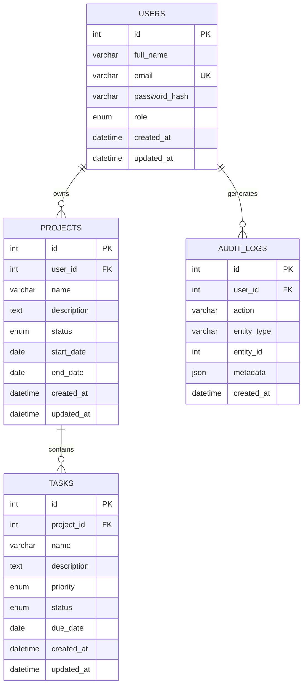

# Database Schema / ER Diagram

Engine: MySQL 8 / MariaDB 10.11 (InnoDB, `utf8mb4`). Full DDL in [`backend/database/schema.sql`](backend/database/schema.sql).

## Design notes

- **Normalization**: 3NF. Each table holds attributes of exactly one entity; `projects.user_id` and `tasks.project_id` are the only cross-entity references, both enforced by foreign keys.
- **Cascades**: deleting a user removes their projects (`ON DELETE CASCADE`); deleting a project removes its tasks (`ON DELETE CASCADE`). Deleting a user sets their audit log rows' `user_id` to `NULL` instead of deleting history (`ON DELETE SET NULL`).
- **Enums over free text**: `status`/`priority`/`role` are MySQL `ENUM` columns: the database itself rejects invalid values, on top of the API-level validation.
- **Indexes**: `user_id` on `projects`, `project_id` on `tasks`, plus indexes on the columns used for filtering/sorting (`status`, `priority`, `name`) so search and filter queries don't scan the full table as data grows.
- **Ownership is enforced at the query level, not just the schema**: every project/task read or write includes a `WHERE user_id = ?` (or a join to the owning project), which is what actually stops one user from reaching another's data: the foreign key alone wouldn't do that.
